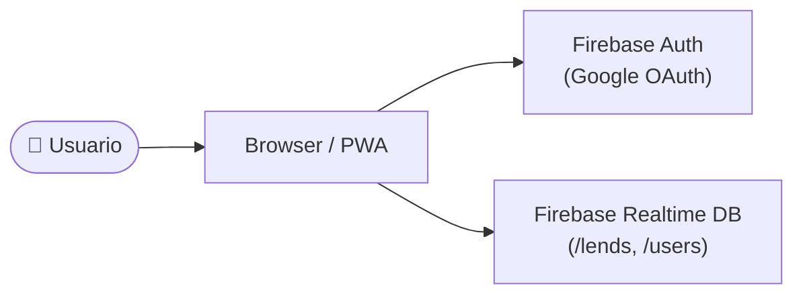
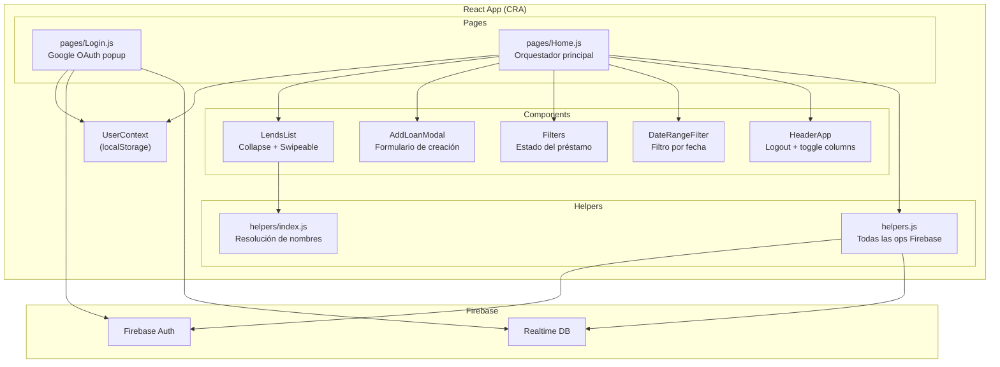
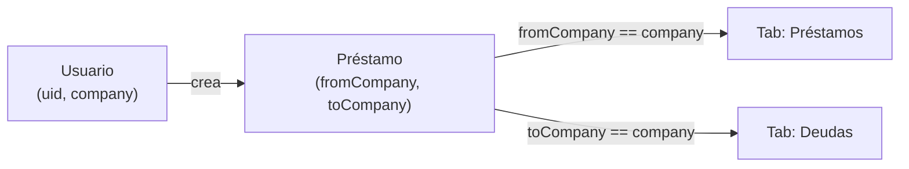

# Diagramas de Componentes

> Referencia estructural estable. Actualizar solo si cambia la topología del sistema.

## Contexto (alto nivel)

## Componentes principales

## Flujo de multi-tenancy

