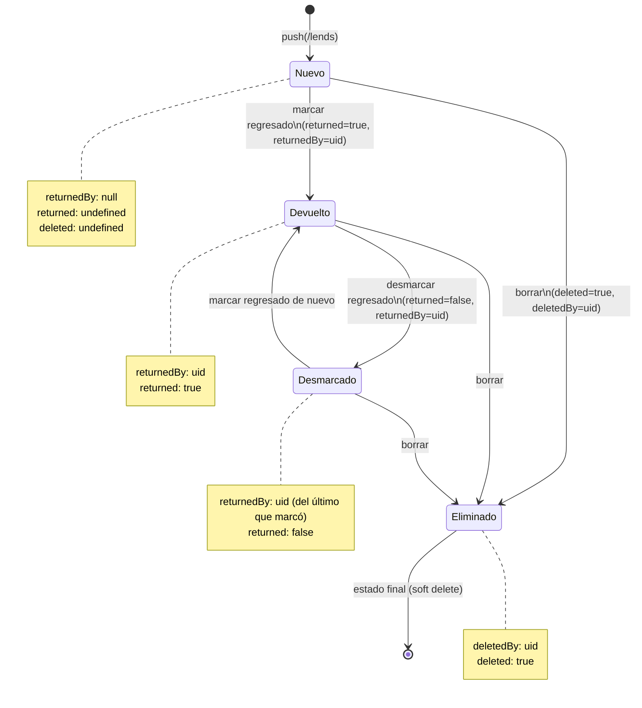
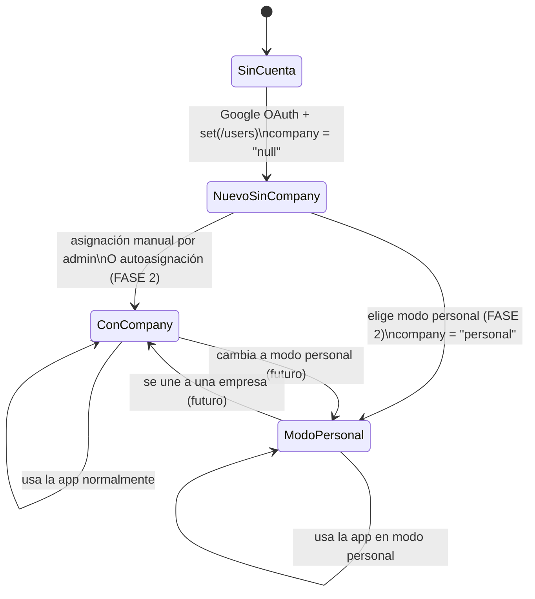

# Diagramas de Estados

> Ciclos de vida de entidades clave. Actualizar solo si cambian las reglas de negocio.

## Ciclo de vida de un Préstamo

```mermaid
stateDiagram-v2
    [*] --> Nuevo : push(/lends)

    Nuevo --> Devuelto : marcar regresado\n(returned=true, returnedBy=uid)
    Nuevo --> Eliminado : borrar\n(deleted=true, deletedBy=uid)

    Devuelto --> Desmarcado : desmarcar regresado\n(returned=false, returnedBy=uid)
    Devuelto --> Eliminado : borrar

    Desmarcado --> Devuelto : marcar regresado de nuevo
    Desmarcado --> Eliminado : borrar

    Eliminado --> [*] : estado final (soft delete)

    note right of Nuevo
        returnedBy: null
        returned: undefined
        deleted: undefined
    end note

    note right of Devuelto
        returnedBy: uid
        returned: true
    end note

    note right of Desmarcado
        returnedBy: uid (del último que marcó)
        returned: false
    end note

    note right of Eliminado
        deletedBy: uid
        deleted: true
    end note
```

## Ciclo de vida de un Usuario

```mermaid
stateDiagram-v2
    [*] --> SinCuenta

    SinCuenta --> NuevoSinCompany : Google OAuth + set(/users)\ncompany = "null"
    NuevoSinCompany --> ConCompany : asignación manual por admin\nO autoasignación (FASE 2)
    NuevoSinCompany --> ModoPersonal : elige modo personal (FASE 2)\ncompany = "personal"

    ConCompany --> ConCompany : usa la app normalmente
    ModoPersonal --> ModoPersonal : usa la app en modo personal
    ConCompany --> ModoPersonal : cambia a modo personal (futuro)
    ModoPersonal --> ConCompany : se une a una empresa (futuro)
```
