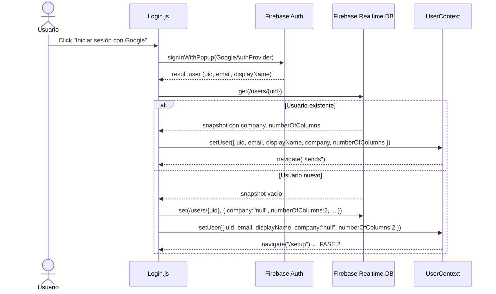
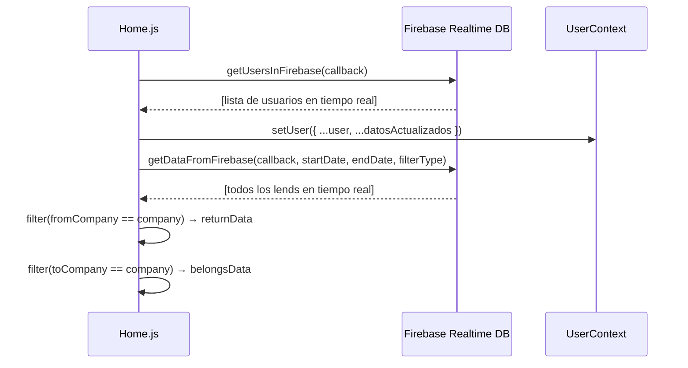
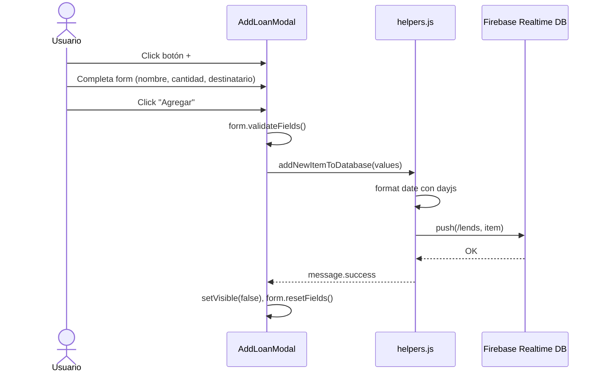
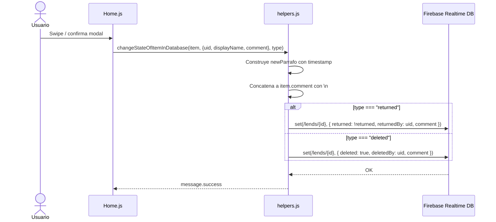

# Diagramas de Secuencia

> Contratos críticos de interacción. Actualizar solo si cambia el flujo de negocio.

## Login / Registro (Google OAuth)

## Carga de datos en Home

## Creación de préstamo

## Cambio de estado (devolver / borrar)

